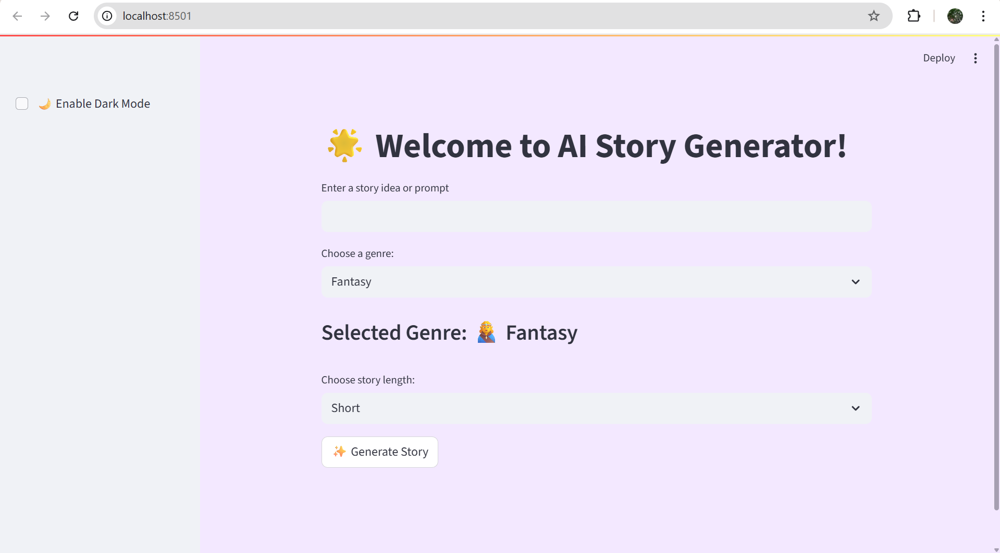
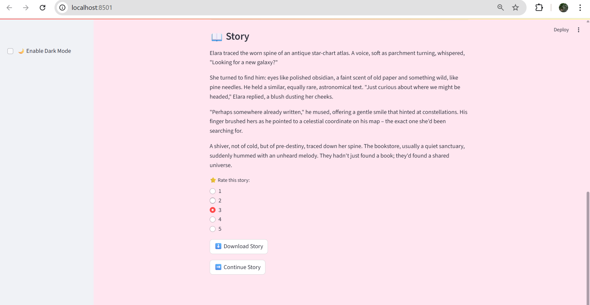
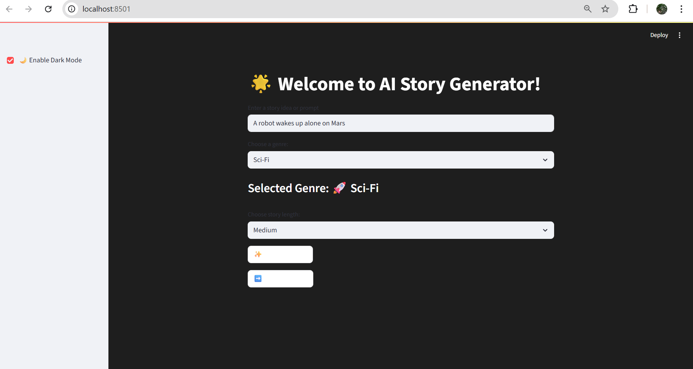
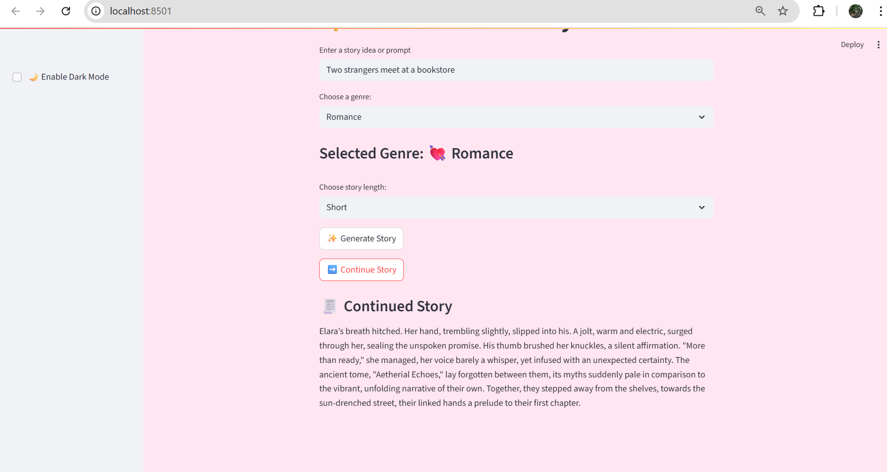

# 🌟 AI Story Generator (Generative Story Builder)

An AI-powered storytelling app built using **Google's Gemini 2.5 Flash API**. This project allows users to input a story prompt, choose a genre and length(short,medium,long), and generate creative stories with titles, ratings, and the generated story can be downloaded  — all in a beautifully themed interface.

---

## ✨ Features

-  Powered by **Gemini 2.5 Flash**
-  **Prompt-based** story generation
- 🎭 Choose from genres: *Romance, Fantasy, Horror, Sci-Fi, Mystery*
-  Automatically generates a **story title**
-  **Dark Mode toggle**
- 🔁 **Continue Story** functionality
- ⭐ **Rate the story** (1 to 5 stars)
- 📥 Download story as `.txt`
- 🖼️ Background theme changes based on genre

---

## 🖼️ Screenshots

### 🏠 Initial Page (Before Generating Story)


### 💘 Romantic Story (Short Prompt)


### 🌗 Dark Mode Example


### 🔁 Story Continuation (Continued story)


---

## 🚀 How to Run

1. **Clone this repo** or [Download ZIP](https://github.com/MekhaManosh/generative-story-builder)

2. Install dependencies:
   ```bash
   pip install -r requirements.txt
